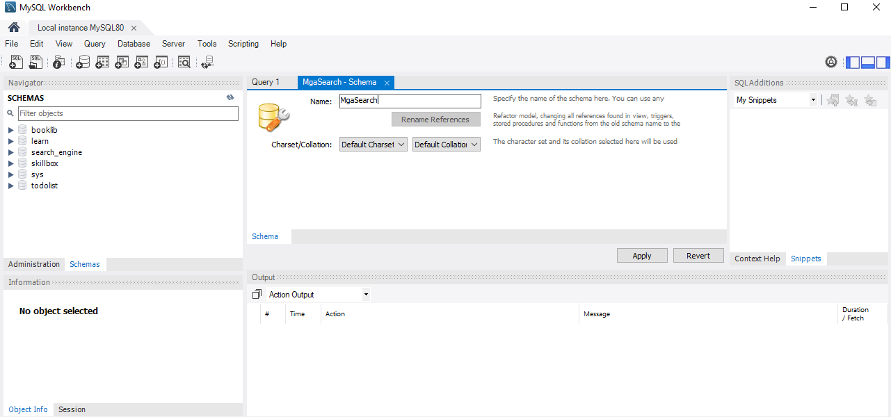
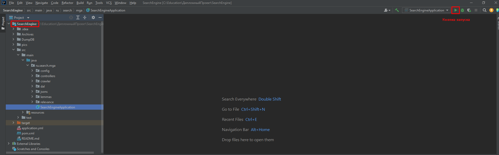

# Дипломный проект "Поисковый движок"

## Краткое описание проекта

 Поисковый движок был разработан в качестве дипломного проекта по курсу **"Java разработчик с нуля"** от Skillbox.
Проект представляет собой web-приложение, предоставляющее следующую функциональность:

1. Чтение параметров из конфигурационного файла. В т.ч. в конфигурационном файле перед запуском приложения задаются адреса сайтов, по которым движок должен будет 
осуществлять поиск.
2. Индексация страниц сайтов (запуск индексации, остановка индексации, добавление/обновление индексации отдельной страницы  одного из 
   индексируемых сайтов). 
3. Поиск информации по задаваемому пользователем поисковому запросу, выдача релевантных результатов поиска.
4. Сбор и отображение статистики о индексации заданнных сайтов.

## Архитектура и использованные технологии

Схема, поясняющая архитектуру приложения, представлена ниже.


При реализации проекта:
- был использован готовый пользовательский интерфейс (UI), реализованный на стеке  HTML, CSS, JavaScript. Для 
  связывания данных между UI и серверной составляющей приложения использован шаблонизатор ThymeLeaf;
- серверная составляющая реализована на платформе Java 17 SDK c использованием фреймворка Spring Boot (реализован 
  REST API, методы которого вызываются скриптами UI);
- при индексации страниц для работы с леммами слов использовался внешний проект "RussianLucieneMorphology" 
  (https://github.com/AKuznetsov/russianmorphology);
- индексация сайтов реализована в многопоточном режиме;
- индексация страниц каждого сайта реализована с использованием фреймворка ForkJoinPool;
- для хранения информации приложения использована база данных под управлением СУБД MySql 8.0.28.

## Краткая инструкция по запуску

### Развертывание базы данных

- Запустить MySQL Workbench, подключиться к рабочему инстансу MySQL.
- В панели "Schemas" контекстного меню создать схему (на рисунке схема названа "MgaSearch")




- Нажать "Apply" (см. ниже), затем нажать "Finish".


- Если все прошло успешно, то созданная схема отобразится в панели "Schemas".


- В каталоге "DumpDB" выложен дамп (резервная копия) базы данных, которую нужно загрузить в созданную схему. 
  Последовательность показана на скриншотах.


Нужно выбрать опцию "Import from self-contained file", затем указать файл дампа, указать созданную схему, затем 
нажать "Start Import".


При успешной загрузке дампа в созданной схеме появятся таблицы базы данных.


### Конфигурирование приложения

Конфигурация приложения описывается в файле "application.yml" в корне проекта. Задайте корректные значения.


### Запуск приложения

После этого откройте проект в IDE (использовалась IDE "intellij idea" (community edition)).

**Примечание**.  Перед запуском может потребоваться добавить зависимости на внешние библиотеки,
расположенные в
каталоге
"ExtLibs", см. меню  "File" - >"Project structure...").

Запустите приложение. 




## Как пользоваться

В браузере перейдите по сконфигурированному URL (см. пример ниже)

````
http://localhost:8080/admin
````

Пользовательский интерфейс разделен на вкладки:
- "Dashboard": отображается статистика индексации сайтов, возможен просмотр подробной информации по интересующему 
  сайту.


- "Management": вкладка с которой осуществлется управление запуском/остановкой индексации сайтов (кнопка 
  "Start indexing") и 
  отдельных страниц (кнопка "Add/Update") сайтов, подлежащих индексации. 


- "Search": на этой вкладке пользователь может осуществлять поиск с использованием поиского запроса по одному сайту 
  или по всем проиндексированным сайтам.

